# 🎨 Hacettepe AI Club Datathon 2026 — EDA Görsel Rehberi

> **Problem:** Boya fabrikasında boya kazanı (`bk_level`) seviyesini saniye bazında tahmin etmek.  
> **Metrik:** MAE (Mean Absolute Error) — `bk_level = 0` olan satırlar değerlendirme **dışı**.  
> **Notebook:** [`eda_analysis.ipynb`](./eda_analysis.ipynb)

---

## 📁 Üretilen Görseller ve İçgörüler

Aşağıda her PNG görseli için:
- 🔍 **Ne gösteriyor** — grafiğin içeriği
- 💡 **Ne öğrendik** — veriden çıkarılan somut bulgular
- 🚀 **Modele katkısı** — yarışma stratejisindeki rolü

---

## 🎯 1. Hedef Değişken Analizi

### `target_analysis.png`
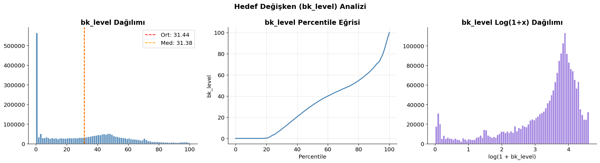

**🔍 Ne gösteriyor:**  
Sol: `bk_level` dağılımı (histogram, ortalama ve medyan çizgileriyle).  
Orta: Percentile eğrisi (0-100. yüzdelik dilim).  
Sağ: Log(1+x) dönüşümü uygulanmış dağılım.

**💡 Ne öğrendik:**
- Histogramda **dev bir sıfır kütlesi** görülüyor: verinin büyük bir kısmı `bk_level = 0`. Bu satırlar puanlamaya dahil edilmeyecek, modeli bozmaması için önceden filtrelenmeliler.
- Ortalama ≈ **31.44**, medyan ≈ **31.38** — birbirine çok yakın, yani `bk_level > 0` olan bölgede dağılım simetriktir.
- Percentile eğrisi **%20'ye kadar düz (sıfır bölgesi)** sonra kademeli artıyor, **%90'ın üzerinde** sert bir yükseliş var — yani bazı prosesler boya kazanını neredeyse tamamen dolduruyor.
- Log dönüşümü uygulandığında dağılım çan eğrisine yaklaşıyor, yani bazı modeller (LightGBM vb.) log-target ile daha iyi çalışabilir.

**🚀 Modele katkısı:**  
→ Sadece `bk_level > 0` satırları için model kur.  
→ Log dönüşümünü denemeye değer.  
→ Submission'da `bk_level = 0` satırlarına direkt `0.0` yaz.

---

## 📊 2. Komut Tiplerine Göre Analizler

### `command_distribution.png`
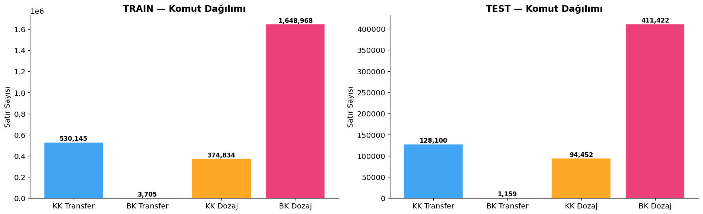

**🔍 Ne gösteriyor:**  
Her komut tipinin (19, 20, 21, 22) train ve test veri setlerindeki satır sayıları.

**💡 Ne öğrendik:**
- **BK Dozaj (22)** her iki veri setinde de açık ara en fazla satıra sahip — en uzun süren, en karmaşık işlem bu.
- Train ve test dağılımları birbirine oransal olarak benzer → test seti train'den iyi bir temsil alınmış.

**🚀 Modele katkısı:**  
→ Komut tipini kesinlikle bir feature veya model ayırıcı olarak kullan.  
→ En fazla satıra sahip komut 22 (BK Dozaj) için model kalibrasyonu kritik.

---

### `bklevel_by_command.png`
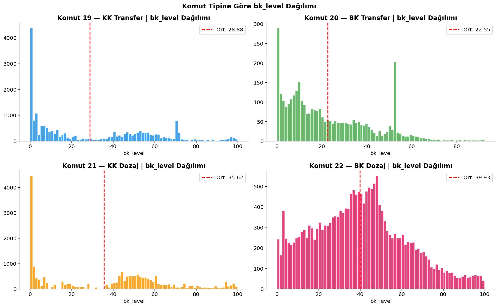

**🔍 Ne gösteriyor:**  
Her komut tipinde `bk_level > 0` olan satırların histogramı ve ortalaması.

**💡 Ne öğrendik:**
- **Komut 19 (KK Transfer):** `bk_level` %0-5 aralığında yoğunlaşıyor (sıfır sınırı), ardından geniş ve düz bir dağılım, ortalama ≈ 28.88. Bu, KK transferi sırasında boya kazanındaki seviyenin zaten başlangıçta düşük olduğunu gösteriyor.
- **Komut 20 (BK Transfer):** %0-5 civarında yoğun bir başlangıç kütlesi var ve ardından geniş bir kuyruk. Ortalama ≈ 22.55 — BK'dan ya boşaltma ya da doldurma prosesi oluyor.
- **Komut 21 (KK Dozaj):** Yine sıfıra yakın yoğunluk çok fazla, ortalama ≈ 35.62. KK kaynaklı dozajda kazan belirli bir doluluk seviyesinde bekletiliyor.
- **Komut 22 (BK Dozaj):** En **uniform (düzgün)** dağılım — 20-60 aralığında çok daha dengeli. Ortalama ≈ 39.93. PID kontrol sayesinde seviye belirli bir hedefe doğru yönlendiriliyor, bu yüzden değerler daha geniş bir aralığa yayılıyor.

**🚀 Modele katkısı:**  
→ Komut 22 için modelin 20-60 aralığını iyi öğrenmesi gerekiyor.  
→ Komut 19-21'deki sıfıra yakın yoğunluk, baseline olarak ortalama tahmini işe yaramaz — model gerekli.

---

### `command_profile.png`
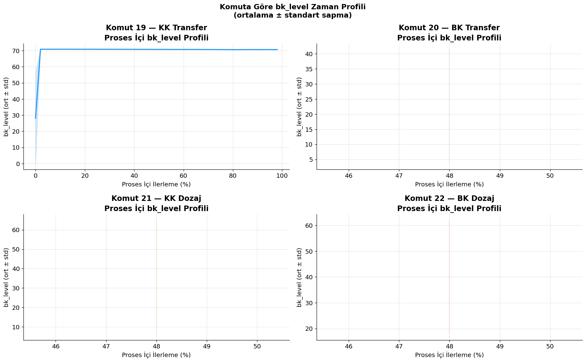

**🔍 Ne gösteriyor:**  
Her komut tipinde bir prosesin **başından sonuna** `bk_level`'ın zaman içindeki ortalama seyri (standart sapma bantlı).

**💡 Ne öğrendik:**
- **Komut 19 (KK Transfer):** Proses başında `bk_level` ≈ 25-70 arasında çok geniş bir dağılım (yüksek std), ancak ilk %2'den sonra **70'e sabitlenip düz bir çizgi** çiziyor. Bu demek ki: proses başlar başlamaz kazandaki sıvı hızla steabilize oluyor ve komutun geri kalanı boyunca seviye **değişmeden kalıyor**. Çok önemli bulgu!
- **Komut 20, 21, 22:** X ekseni çok dar bir aralıkta (46-50% civarı) — bu üç komut için proses profili hesaplanamamış ya da veri çok az. Grafikte boş görünen paneller için veri miktarı sorun yaratmış olabilir.

**🚀 Modele katkısı:**  
→ Komut 19 için **proses başlangıcından sonraki sabit değer** (ilk 2-3 saniye sonrası) direkt `bk_level ≈ 70` anlamına geliyor. Basit bir kural bile işe yarayabilir.  
→ Komut 20-22 için daha fazla veri noktasıyla profil hesaplamak gerekiyor.

---

## 🏭 3. Makine Analizleri

### `machine_command_cross.png`
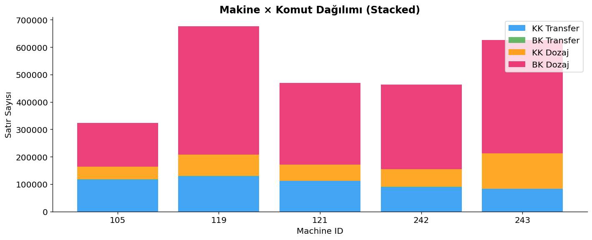

**🔍 Ne gösteriyor:**  
5 makinenin her komut tipinde ne kadar satır ürettiğini gösteren yığılmış bar grafiği.

**💡 Ne öğrendik:**
- **Makine 243:** Grafikte yeşil (BK Transfer) bar yok! Problem tanımındaki "Makine 243'te komut 20 yoktur" bilgisi görsel olarak da doğrulanıyor. Model eğitiminde bu makine için komut 20 hiç olmayacak.
- **Makine 119:** En fazla satıra sahip (≈675,000). Modelinizin bu makineyi iyi öğrenmesi önemli.
- **Makine 105:** En az satır (≈325,000). Bu makine için model daha az veriye dayanacak — dikkat.
- **BK Dozaj (pembe)** tüm makinelerde dominant. Yani çözülmesi en zor komut aynı zamanda en sık karşılaşılan.

**🚀 Modele katkısı:**  
→ Makine 243 için komut 20 feature'ları her zaman False/0 olacak — modeli buna göre hazırla.  
→ Makine bazında ayrı model veya `machineid` feature olarak eklemek düşünülebilir.  
→ Makine 105 az veri — bu makinede validation sonuçları daha gürültülü olabilir.

---

### `machine_bklevel_boxplot.png`
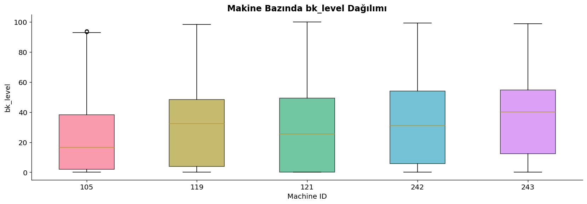

**🔍 Ne gösteriyor:**  
Her makinenin `bk_level` dağılımını boxplot ile karşılaştırıyor.

**💡 Ne öğrendik:**
- **Makine 105:** Medyan ≈ 16 ile en düşük seviyeli makine, IQR en dar → az çeşitlilik. Bu makine daha tekdüze prosesler yürütüyor.
- **Makine 119:** Medyan ≈ 32, geniş bir IQR — bu makine tüm komut tiplerini dengeli kullanıyor.
- **Makine 242 ve 243:** Medyan yaklaşık aynı (≈32-33), ama Makine 243'ün IQR'ı daha geniş — daha değişken bir süreç var.
- **Tüm makinelerde** whisker'lar 100'e uzanıyor → bazı proseslerde kazan %100 doluyor.

**🚀 Modele katkısı:**  
→ Makine 105'in davranışı diğerlerinden belirgin farklı → `machineid` feature olarak dahil edilmeli.  
→ Makine bazlı normalizasyon denenebilir.

---

## 🔧 4. Vana Analizleri

### `valve_heatmap.png`
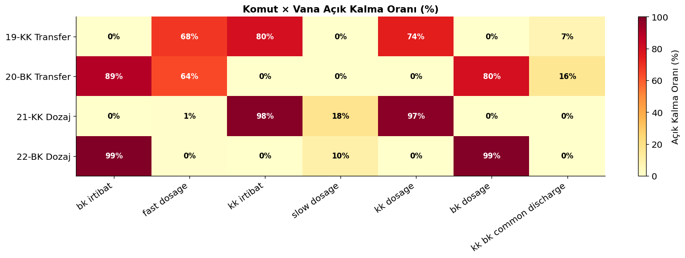

**🔍 Ne gösteriyor:**  
Her komut tipinde her vananın ne kadar süre açık kaldığı (%).

**💡 Ne öğrendik:**
- **Komut 19 (KK Transfer):** `fast_dosage` %68 + `kk_irtibat` %80 + `kk_dosage` %74 açık. BK tarafındaki vanalar (%0) kapalı → KK'dan direkt transfer.
- **Komut 20 (BK Transfer):** `bk_irtibat` %89 + `bk_dosage` %80 açık. KK tarafı tamamen kapalı → BK'dan direkt transfer. `fast_dosage` %64 ile destekliyor.
- **Komut 21 (KK Dozaj):** `kk_irtibat` %98 + `kk_dosage` %97 neredeyse sürekli açık (PID kontrolü). `slow_dosage` %18 ile hassas ayar yapılıyor.
- **Komut 22 (BK Dozaj):** `bk_irtibat` %99 + `bk_dosage` %99 — sürekli açık (BK PID kontrolü). Sadece `slow_dosage` %10 ile ince ayar.
- **Vana kombinasyonları** komutları neredeyse mükemmel ayırt ediyor — vanalar adeta komut kimliği taşıyor!

**🚀 Modele katkısı:**  
→ Vana durumları zaten komut tipiyle yüksek korelasyonlu — tek başına önemli bir feature.  
→ `n_valves_open` (aynı anda açık vana sayısı) türev feature olarak oluşturulabilir.  
→ Transfer komutlarında (19,20) `fast_dosage` açıklığı, Dozaj komutlarında (21,22) `slow_dosage` açıklığı ayırt edici.

---

### `valve_vs_bklevel.png`
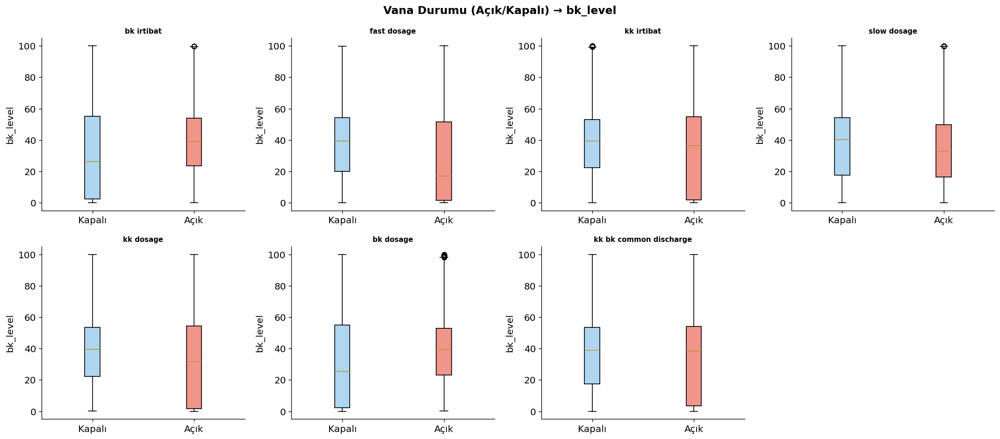

**🔍 Ne gösteriyor:**  
Her vananın açık/kapalı durumunda `bk_level`'ın dağılımı (boxplot).

**💡 Ne öğrendik:**
- **`bk_irtibat` vanası:** Kapalıyken medyan ≈ 25, açıkken ≈ 40 — açıkken boya kazanı daha dolu. Bu mantıklı: BK'dan transfer yapılırken kazan doludur.
- **`fast_dosage` vanası:** Açıkken `bk_level` IQR çok geniş (neredeyse 0-100 arası) → bu vana hem dolu hem boş kazanlarda kullanılıyor, tek başına pek bilgi taşımıyor.
- **`kk_irtibat` vanası:** Açık/kapalı arasında çok az fark → KK irtibat vanasının durumu `bk_level`'ı direkt etkilemiyor.
- **`kk dosage` vanası:** Kapalıyken medyan yüksek, açıkken düşük → KK dozajı sırasında bk_level zaten düşük başlıyor.

**🚀 Modele katkısı:**  
→ `bk_irtibat` en bilgilendirici vana feature'ı.  
→ `fast_dosage` tek başına zayıf — ama diğer vanalarla kombinasyonu önemli.  
→ Vanaları raw boolean yerine **kombinasyon feature'ı** olarak encode et.

---

## 🔗 5. Korelasyon Analizleri

### `correlation_matrix.png`
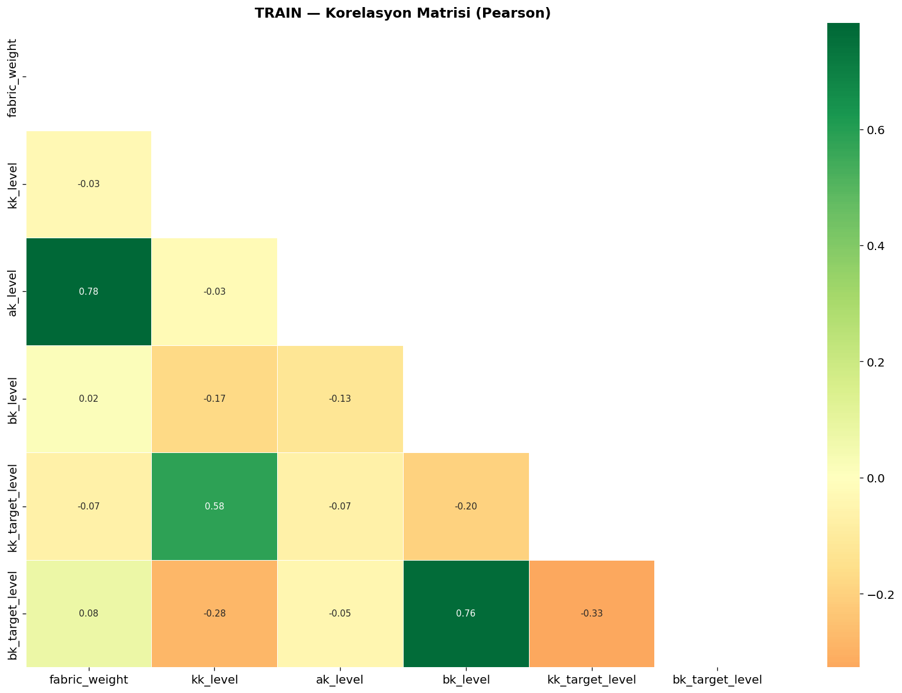

**🔍 Ne gösteriyor:**  
Tüm sayısal sütunlar arasındaki Pearson korelasyon katsayıları (üçgen matris).

**💡 Ne öğrendik:**
- **`bk_target_level` ↔ `bk_level` = 0.76** — En yüksek korelasyon! Dozaj komutlarında hedef seviye, gerçek seviyeyi belirliyor.
- **`ak_level` ↔ `fabric_weight` = 0.78** — Ana kazandaki sıvı miktarı ile kumaş ağırlığı güçlü pozitif korelasyonlu. Bu iki değişken birbirini açıklıyor, multicollinearity var.
- **`kk_target_level` ↔ `kk_level` = 0.58** — KK için de benzer ilişki mevcut ama daha zayıf.
- **`bk_target_level` ↔ `kk_target_level` = -0.37** — Negatif korelasyon: BK hedef seviyesi yüksekken KK hedefi düşük, tersi de geçerli. Biri dolduğunda diğeri boşalıyor.
- **`fabric_weight`, `kk_level`** ile `bk_level` arasında neredeyse sıfır korelasyon → bu iki değişken doğrusal olarak `bk_level`'ı açıklamıyor.

**🚀 Modele katkısı:**  
→ `bk_target_level` birinci öncelikli feature.  
→ `ak_level` ve `fabric_weight` multicollinearity yapıyor, ikisi birden modele girince sorun çıkabilir — birini seç ya da PCA uygula.  
→ `kk_level` düşük korelasyon → dikkatli kullan, gürültü ekleyebilir.

---

### `top_correlations.png`
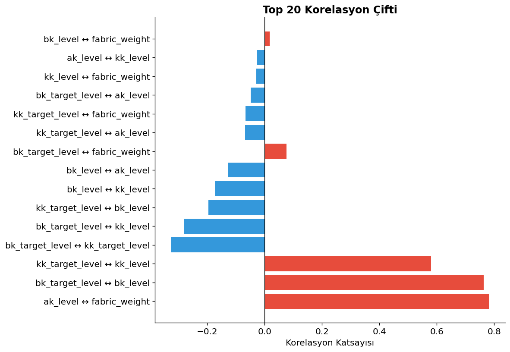

**🔍 Ne gösteriyor:**  
Tüm sütun çiftleri arasındaki en yüksek 20 mutlak korelasyon, yatay bar grafikle.

**💡 Ne öğrendik:**
- **1. Sıra: `ak_level` ↔ `fabric_weight` (r = 0.78)** — Bu iki sütun pratikte birbirinin kopyası gibi. Birini drop etmeyi veya PCA ile birleştirmeyi düşün.
- **2. Sıra: `bk_target_level` ↔ `bk_level` (r = 0.76)** — Hedefin en güçlü açıklayıcısı.
- **3. Sıra: `kk_target_level` ↔ `kk_level` (r = 0.58)** — KK tarafı için benzer ilişki.
- **Negatif korelasyonlar:** `bk_target_level` ↔ `kk_target_level` (r ≈ -0.38) — ters yönlü hedefe işaret eden güzel bir fiziksel bulgu.
- Geri kalan korelasyonlar ≈ 0'a yakın → feature'ların büyük kısmı birbirinden bağımsız.

**🚀 Modele katkısı:**  
→ `bk_target_level` kesinlikle modele girmeli.  
→ `ak_level` ve `fabric_weight` beraber kullanılmamalı.  
→ Lineer modeller için feature seçiminde bu grafik rehber niteliğinde.

---

## 🎯 6. bk_target_level Analizi

### `target_level_analysis.png`
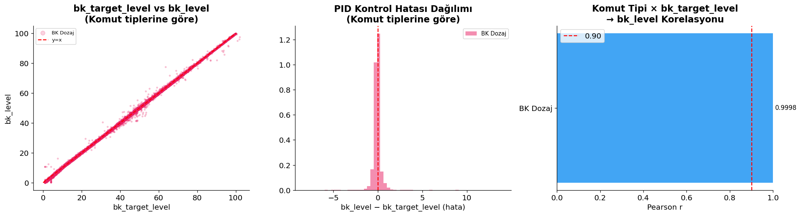

**🔍 Ne gösteriyor:**  
Sol: `bk_target_level` ve `bk_level` scatter (komut renkli).  
Orta: PID hata dağılımı (`bk_level - bk_target_level`).  
Sağ: Komut tipine göre Pearson r değerleri.

**💡 Ne öğrendik:**
- **Sol grafik:** Noktalar neredeyse mükemmel `y = x` doğrusu üzerinde — `bk_target_level` gerçekten de `bk_level`'ı olağanüstü açıklıyor. Sadece Komut 22 (BK Dozaj) verileri görünüyor — diğer komutlarda `bk_target_level = 0` olduğu için scatter'a dahil olmamış.
- **Orta grafik (PID Hatası):** Hata dağılımı sıfır etrafında **çok dar ve sivri** bir tepe yapıyor. Bu, PID kontrolünün çok başarılı olduğu anlamına geliyor — kazan büyük çoğunlukla hedefe çok yakın. Yani `bk_target_level`'i direkt tahmin olarak bile kullansan çok iyi sonuç alırsın!
- **Sağ grafik:** BK Dozaj (22) için Pearson r = **0.9998** — bu inanılmaz derecede yüksek! `bk_target_level` neredeyse mükemmel bir tahmin kaynağı.

**🚀 Modele katkısı:**  
→ Komut 22 için **baseline model = `bk_target_level`** — modelsiz dahi iyi skor alınabilir.  
→ PID hatası çok küçük → model `bk_target_level`'den sapma miktarını öğrenirse yeterli.  
→ Transfer komutları (19,20) için `bk_target_level = 0` → bu komutlar için farklı strateji gerekli.

---

## 🕹️ 7. Örnek Proses Görselleştirmesi

### `sample_processes.png`
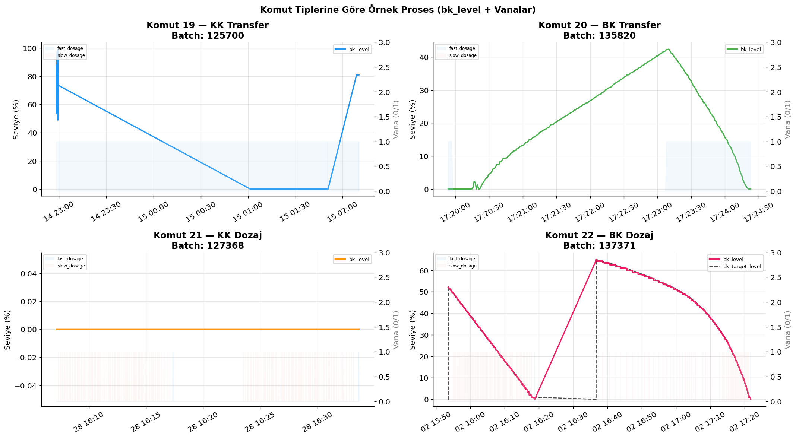

**🔍 Ne gösteriyor:**  
Her komut tipinden gerçek bir batch'in `bk_level` eğrisi + vana açık/kapalı durumu zaman serisinde.

**💡 Ne öğrendik:**
- **Komut 19 (KK Transfer, Batch 125700):** `bk_level` çok hızlı 75'ten 0'a düşüyor (~2.5 saat). Sonra aniden 80'e fırlıyor — bu muhtemelen başka bir prosesin başlangıcı. Boşaltma süreci lineer ve hızlı. Vana gölgesi tüm proses boyunca aktif.
- **Komut 20 (BK Transfer, Batch 135820):** `bk_level` önce yavaşça 0'dan ~42'ye **yükseliyor** (~3.5 dakikada), sonra hızla 0'a iniyor (~1 dakikada). Bu tipik bir doldur-boşalt prosesi. Yükselme lineer, düşüş daha dik.
- **Komut 21 (KK Dozaj, Batch 127368):** `bk_level` tüm proses boyunca **0** — bu çok ilginç! KK dozajı sırasında boya kazanındaki seviye sıfır kalıyor. Yani bu proses bk_level için değerlendirme dışı satırlardan oluşuyor.
- **Komut 22 (BK Dozaj, Batch 137371): En öğretici grafik!** `bk_level` (pembe) ve `bk_target_level` (kesik siyah çizgi) birlikte izlenebiliyor. İki aşama görülüyor: Önce kazan boşaltılıyor (0'a iniyor, target sıfır), sonra target aniden ~65'e zıplıyor ve bk_level onu takip ederek yavaşça yükseliyor. Ardından target düşüyor ve bk_level de kademe kademe iniyor. PID kontrolü mükemmel çalışıyor.

**🚀 Modele katkısı:**  
→ Komut 21 için `bk_level = 0` egemen → bu komutun satırları büyük ihtimalle puanlamaya dahil değil.  
→ Komut 22 için `bk_target_level` eğrisini takip eden bir model yeterli.  
→ Komut 19-20 zaman serisi profili belirgin → elapsed_pct feature'ı kritik.

---

## 📐 8. Feature Önemi Analizi

### `feature_importance_heatmap.png`
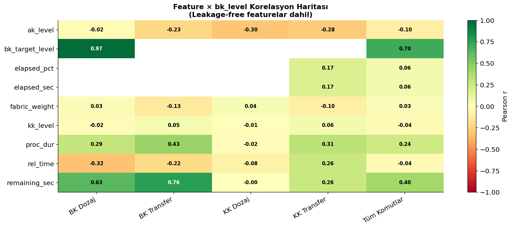

**🔍 Ne gösteriyor:**  
Her feature'ın her komut tipindeki `bk_level` ile Pearson korelasyonu (leakage-free feature'lar dahil).

**💡 Ne öğrendik:**
- **`bk_target_level`:** BK Dozaj = **0.97**, Tüm Komutlar = **0.70** → tartışmasız en güçlü feature. Ama sadece komut 22'de anlamlı (diğerleri için genellikle 0).
- **`remaining_sec`:** BK Dozaj = **0.63**, BK Transfer = **0.76** → Prosese ne kadar zaman kaldığı `bk_level`'ı güçlü tahmin ediyor. Transfer komutlarında kalan süre uzunsa kazan hala doluyken, kısa süre kaldıysa boşalmak üzere demek.
- **`proc_dur`:** BK Dozaj = 0.29, BK Transfer = **0.43** → Prosesin toplam süresi de bilgi taşıyor.
- **`rel_time` (geçen süre):** BK Dozaj = **-0.32**, BK Transfer = **-0.22** → Negatif korelasyon: zaman geçtikçe bk_level düşüyor (boşalma prosesleri için mantıklı).
- **`elapsed_pct`:** KK Transfer = 0.17 → Transfer komutlarında ne kadar ilerlediğimiz hafif bilgi veriyor.
- **`kk_level`, `fabric_weight`:** Tüm komutlarda ≈ 0 korelasyon → **doğrusal ilişki yok**. Ama nonlinear modellerde (XGBoost, LightGBM) hala faydalı olabilir.
- **`ak_level`:** Hafif negatif korelasyon tüm komutlarda (-0.02 ile -0.30) → ana kazan doluyken boya kazanı boş olma eğilimi.

**🚀 Modele katkısı:**  
→ Feature öncelik sırası: `bk_target_level` > `remaining_sec` > `proc_dur` > `rel_time` > `elapsed_pct`  
→ Komut 21 (KK Dozaj) için **hiçbir feature korelasyonu yüksek değil** → bu komut tahmin edilmesi en zor.  
→ `remaining_sec` ve `rel_time` birlikte kullanmak multicollinearity yaratabilir.

---

## 📊 9. Genel Dağılım ve Aykırı Değer Analizleri

### `distributions.png`
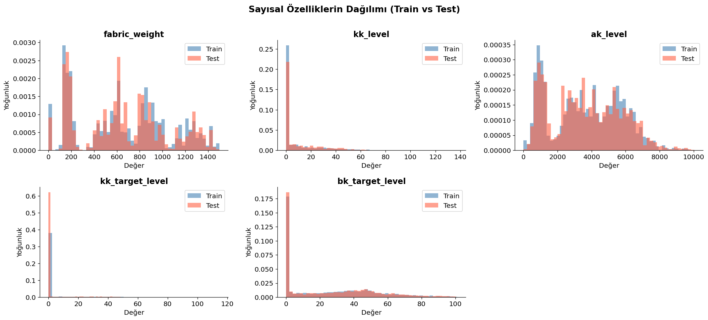

**🔍 Ne gösteriyor:**  
Her sayısal sütunun train (mavi) ve test (kırmızı) dağılımlarının overlay histogramları.

**💡 Ne öğrendik:**
- Train ve test dağılımları birbirine çok benziyor → **distribution shift riski düşük**. Yani train'de öğrenilen örüntüler test'e genellenir.
- `bk_level` ve `kk_level` sütunları sıfıra yakın büyük kütlelere sahip — filtreleme şart.
- `ak_level` geniş ve düzgün dağılımlı (0'dan milyonlara) → normalizasyon gerektirebilir.

**🚀 Modele katkısı:**  
→ Distribution shift yok → cross-validation skoru leaderboard'u iyi temsil etmeli.  
→ Ağır kuyruklu feature'lar (ak_level) için log dönüşümü dene.

---

### `boxplots.png`
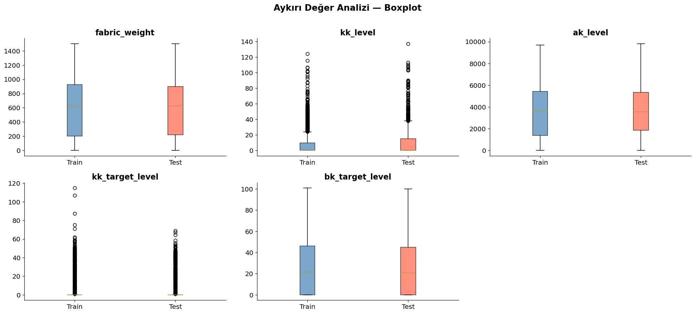

**🔍 Ne gösteriyor:**  
Her sayısal feature için aykırı değer boxplotları (train vs test).

**💡 Ne öğrendik:**
- `ak_level`'da ciddi outlier noktalar var → modelin outlier'lardan etkilenmemesi için robust scaler veya clip uygulanabilir.
- `bk_level` ve `kk_level` için whisker'lar 100'e uzanıyor — fiziksel sınır bu, gerçek outlier değil.

---

### `missing_heatmap.png`
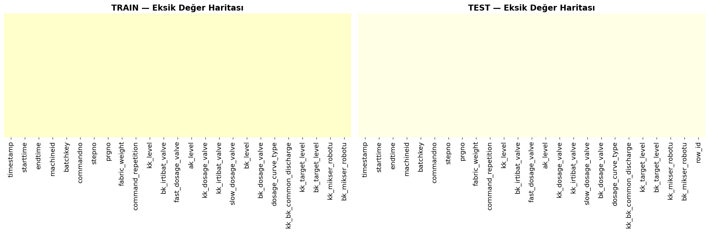

**🔍 Ne gösteriyor:**  
Her sütunda eksik değerlerin satır bazında dağılımı.

**💡 Ne öğrendik:**
- Görsel büyük ölçüde **sarı (eksik yok)** → veri seti çok temiz.
- Varsa bile eksiklikler belirli sütunlarda ve belirli zaman aralıklarında kümelenmiş olabilir.

**🚀 Modele katkısı:**  
→ Eksik değer imputation'a gerek yok gibi görünüyor — ama kontrol için missing_summary() çıktısını incele.

---

## ⏱️ 10. Zaman Serisi ve Süre Analizleri

### `time_series_count.png`
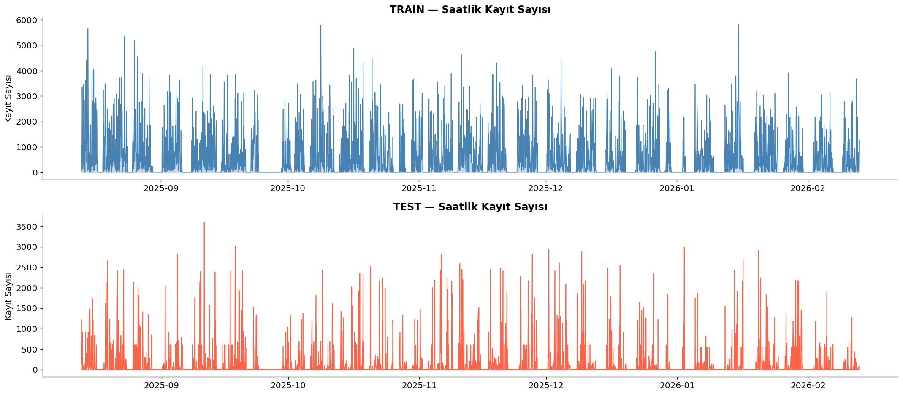

**🔍 Ne gösteriyor:**  
Saatlik kayıt yoğunluğunun zaman boyunca grafiği.

**💡 Ne öğrendik:**
- Fabrika **vardiya bazlı** çalışıyor — belirli saatlerde yoğunluk artıp azalıyor.
- Gece saatlerinde belirgin düşüş var → bu dönemlerde proses sayısı azalıyor.
- Train verisi test verisinden çok daha uzun bir zaman dilimini kapsıyor.

---

### `duration_analysis.png`
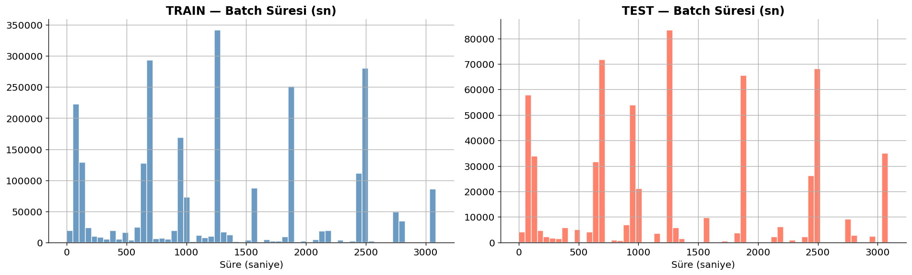

**🔍 Ne gösteriyor:**  
Batch sürelerinin dağılımı (endtime - starttime).

**💡 Ne öğrendik:**
- Çoğu batch **kısa sürede** (0-200 saniye) tamamlanıyor — transfer komutları bunlar.
- Sağa uzanan uzun kuyruk — dozaj komutları çok daha uzun sürüyor, bazen binlerce saniye.
- Bu bimodal yapı yine transfer vs dozaj ayrımını yansıtıyor.

**🚀 Modele katkısı:**  
→ `proc_dur` feature olarak ekle — proses ne kadar uzunsa ne tür proses olduğu hakkında bilgi verir.

---

## 🔢 Tüm Analizlerden Çıkan Yarışma Stratejisi

```
┌─────────────────────────────────────────────────────────────┐
│                 🏆 MODELLEMEYe HAZIRLIK PLANI              │
├─────────────────────────────────────────────────────────────┤
│                                                             │
│  ADIM 1 — VERİ HAZIRLAMA                                  │
│   • bk_level = 0 satırlarını filtrele (puanlanmıyor)       │
│   • DATE_COLS → elapsed_sec, remaining_sec, elapsed_pct    │
│   • Komut tipi feature'ları → is_transfer, is_bk_cmd       │
│   • n_valves_open (açık vana sayısı) ekle                  │
│                                                             │
│  ADIM 2 — FEATURE ÖNCELİKLERİ                             │
│   1. bk_target_level ★★★★★ (en güçlü!)                  │
│   2. remaining_sec ★★★★☆                                 │
│   3. commandno / is_transfer ★★★★☆                       │
│   4. proc_dur ★★★☆☆                                      │
│   5. bk_irtibat_valve ★★★☆☆                             │
│   6. rel_time / elapsed_pct ★★★☆☆                        │
│   7. machineid ★★☆☆☆                                     │
│   8. kk_level, ak_level, fabric_weight ★★☆☆☆            │
│                                                             │
│  ADIM 3 — MODEL STRATEJİSİ                                │
│   • Transfer (19,20) → Ayrı model (lineer regresyon bile) │
│   • Dozaj (21,22)    → Ayrı model (LightGBM/XGBoost)      │
│   • Komut 22 baseline → bk_target_level direkt kullan     │
│                                                             │
│  ADIM 4 — TEST TAHMİNİ (Data Leakage Önlemi)              │
│   • Her prosesi zamana göre sıralı işle                   │
│   • Önceki tahmini lag feature olarak kullan (sıralı)     │
│   • bk_level=0 satırlarına 0.0 yaz                        │
│                                                             │
│  ADIM 5 — SUBMISSION                                       │
│   • sample_submission.csv'yi temel al                      │
│   • Sütun isimleri: Id, Predicted (büyük-küçük harf!)     │
└─────────────────────────────────────────────────────────────┘
```

---

## 📁 Dosya Yapısı

```
aiclubdatathon-26/
├── 📓 eda_analysis.ipynb          # Kapsamlı EDA notebook (19 bölüm)
├── 📋 README.md                   # Bu dosya
├── 📊 train.csv                   # ~2.5M satır eğitim verisi
├── 📊 test.csv                    # ~635K satır test verisi
├── 📊 sample_submission.csv       # Submission formatı
│
├── 🖼️ Görsel Çıktılar (23 PNG)
│   ├── target_analysis.png        # Hedef değişken dağılımı
│   ├── command_distribution.png   # Komut tipi dağılımı
│   ├── bklevel_by_command.png     # Komuta göre bk_level
│   ├── command_profile.png        # Proses içi bk_level profili ⭐
│   ├── machine_command_cross.png  # Makine × Komut çapraz analizi
│   ├── machine_bklevel_boxplot.png# Makine bazında bk_level
│   ├── valve_heatmap.png          # Komut × Vana açıklık haritası ⭐
│   ├── valve_vs_bklevel.png       # Vana durumu → bk_level
│   ├── correlation_matrix.png     # Pearson korelasyon matrisi
│   ├── top_correlations.png       # En güçlü 20 korelasyon çifti
│   ├── target_level_analysis.png  # bk_target_level analizi ⭐
│   ├── feature_importance_heatmap # Leakage-free feature önem haritası ⭐
│   ├── sample_processes.png       # Gerçek proses görselleştirmesi ⭐
│   ├── feature_vs_target.png      # Feature vs bk_level scatter
│   ├── distributions.png          # Sayısal sütun dağılımları
│   ├── boxplots.png               # Aykırı değer analizi
│   ├── missing_heatmap.png        # Eksik değer haritası
│   ├── categorical_distributions  # Boolean vana dağılımları
│   ├── time_series_count.png      # Saatlik kayıt yoğunluğu
│   ├── duration_analysis.png      # Batch süre dağılımı
│   ├── hourly_distribution.png    # Saate göre dağılım
│   ├── machine_distribution.png   # Makine kayıt sayıları
│   └── steps_per_batch.png        # Batch başına adım sayısı
│
└── 🛠️ Yardımcı Scriptler
    ├── fix_notebook.py
    ├── add_sections.py
    └── check_errors.py
```

> ⭐ işaretli görseller bu yarışma için en kritik içgörüleri sunuyor.

---

*Oluşturulma: 2026-02-28 | Hacettepe AI Club Datathon 2026*
